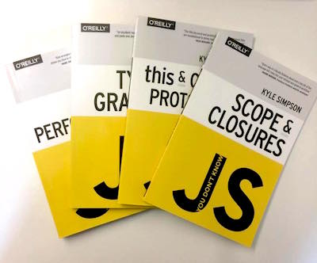
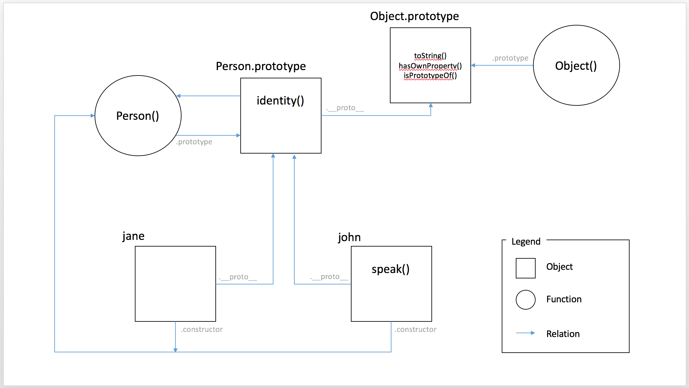

# Know your Javascript
<br>
<small>by Peter Cosemans</small>
<small>v1.0 - 18 jan 2017</small>

---

# Learn Javascript

<br>

> https://github.com/getify/You-Dont-Know-JS

---

# JavaScript History
> Javascript is older then you think

----

## When it all started

- 1994: Netscape Navigator is released
- 1995: [Brendan Eich](https://en.wikipedia.org/wiki/Brendan_Eich) joined Netscape, initialy to add 'Scheme' language to the browser.
- 1995: Sun puts pressure on Netscape to add Java to the browser.
    + To complex, not for amateur programmer
    + Brendan helps Netscape decide
    + Brendan starts a new language
        * In 10 days!
        * Code Name: Mocha
    + Mocha was renamed to LiveScript (sept 1995)
    + LiveScript was later renamed to JavaScript (dec 1995)
- 1996: People start using Javascript

----

## Ecmascript 3

- 1996: Microsoft is comming with IE. Netscape in problem.
- 1997: Netscape reches out to Ecma. JS was standardized: Ecmascript
- 1999: Ecmascript 3
    + Life is Good
    + More people implementing ES spec
    + More people/companies get involved (Apple, Yahoo, Adobe, ...)

----

## Internet Explorer

- 1999 - 2005
    + IE Crushes NetScape
    + 2003 Netscape ends
    + IE Glory Days
    + Talks start for ES4: 2005
    + Conflicting ideas
        * Crockford: Remove bad parts
        * MS: Keep it backwards compatible
        * Adobe: Add classes and flex stuff
        * Crock/MS/Yahoo (ES3.1) vs Adobe/Opera/Mozilla (ES4)

----

## Harmony

- 2008
    + TC39 agree to postpone ES4 and to implement ES3.1 (and rename to ES5)
    + Commitee is working together now. New features set: Harmony
- 2009: ES5 is official
- Today:
    + TC39 has finalized ES6
    + TC39 works on features for ES7/ES8
    + Browsers are inplementing ES6 and beyond

---

# NodeJS (quick start)

> Your Javascript engine for the desktop

----

## Install

Homebrew (OSX)

    brew cleanup
    brew install node

Chocolatey (Windows)

    C:\> choco install nodejs.install

Download links

    https://nodejs.org/en/download/

----

## Which version - LTS or Current


----

## Run your code

Your JS file

    // main.js
    console.log('Hello node');

To run

    $ node main
    Hello node

To auto restart after file change

    $ npm install nodemon -g
    $ nodemon main.js
    [nodemon] 1.9.2
    [nodemon] to restart at any time, enter `rs`
    [nodemon] watching: *.*
    [nodemon] starting `node main.js`
    Hello node
    [nodemon] clean exit - waiting for changes before restart

----

### Multiple node versions

OSX

    // install
    $ npm install n -g

    // use
    $ n 5.5.0

Windows

```json
// install
https://github.com/coreybutler/nvm-windows/releases
```

    // use
    $ nvm list available
    $ nvm install 4.4.5
    $ nvm use 4.4.5

Switch node by project

    // install
    $ npm install -g avn avn-nvm (or avn-n)
    $ avn setup
    $ echo '4.4.5' > ./myproject/.node-version

    // use
    $ cd /myproject

---

# Use Strict

> A better javascript

----

## Strict

The syntax, for declaring [strict mode](https://developer.mozilla.org/en-US/docs/Web/JavaScript/Reference/Strict_mode), was designed to be compatible with older versions of JavaScript. <small>Strict mode was introduced in ES5.</small>

```
"use strict";
var a = '1234';
console.log(b);         // error
```

Not Allowed to:
- Using a variable/object without declaring it
- Deleting a variable
- Writing to a read only property
- With statement
- Keywords: interface, private, yield, ...
- ...

> ***Guideline***: always 'use strict' when using Javascript

---

# Lexical Scope & Hoisting

> Where to look for things.

----

## JavaScript has lexical scoping with function scope.

Do you know the answer?

```
    var foo = 'bar';
    function bar() {
        var foo = 'baz';

        function baz(foo) {
            foo = 'bam';
            bam = 'yay';
        }

        baz();
    }

    bar();
    name;           // ?????
    foo;            // ?????
    bam;            // ?????
    baz();          // ?????
```

----

Answer!

```
    var foo = 'bar';
    function bar() {
        var foo = 'baz';

        function baz(foo) {
            foo = 'bam';
            bam = 'yay';
        }

        baz();
    }

    bar();
    name;           // undefined (none strict)
    foo;            // 'bar'
    bam;            // 'yay'
    baz();          // Error!
```

> The answer is defined by the hoisting behavior of Javascript.

----

## Variable Hoisting

What the value of?

```javascript
a;              // ???
b;              // ???
var a = b;
var b = 2;
b;              // 2
a;              // ???
```

Result
<!-- .element: class="fragment" data-fragment-index="1" -->

```javascript
var a = undefined:  // compiler hoised these
var b = undefined:  // compiler hoised these
a;              // undefined
b;              // undefined
a = b;
b = 2;
b;              // 2
a;              // 2
```
<!-- .element: class="fragment" data-fragment-index="1" -->

----

## Block scoping

What is the value logged?

```javascript
var foo = 2;
if (true) {
    var bar = 1;
}
console.log( foo + bar);  // throws error, 2, 3 of undefined
```

Result
<!-- .element: class="fragment" data-fragment-index="1" -->

```javascript
var foo = 2;
var bar = undefined;
if (true) {
    bar = 1;    // 'b' wasn't declared in here
}
console.log( foo + bar);  // 3
```
<!-- .element: class="fragment" data-fragment-index="1" -->

> Javascript doesn't has block scoping
<!-- .element: class="fragment" data-fragment-index="1" -->

----

## Declared / undeclared

What if I use it before it is declared?

```javascript
console.log(name);   // WHAT HAPPENS HERE?
var name = 'marc';
```

Result
<!-- .element: class="fragment" data-fragment-index="1" -->

```javascript
    console.log(name);   // undefined
    var name = 'marc';
```
<!-- .element: class="fragment" data-fragment-index="1" -->
```javascript
    "use strict"
    console.log(name);   // Error!
    var name = 'marc';
```
<!-- .element: class="fragment" data-fragment-index="1" -->

----

## Function scoping

What is the console output?

```javascript
var a = 1;
function run() {
    var a = 2;
    console.log(a);
}
run();
console.log(a);
```

Result
<!-- .element: class="fragment" data-fragment-index="1" -->

```javascript
var a = 1;
function run() {
    var a = 2;
    console.log(a);     // 2
}
run();
console.log(a);         // 1
```
<!-- .element: class="fragment" data-fragment-index="1" -->

> Javascript has function scoping
<!-- .element: class="fragment" data-fragment-index="1" -->

----

## What about

Multiple vars

```javascript
var a = 0;
var a = 1;
console.log(a);     // error, 0, 1?
```

Loop

```javascript
for(var i = 0; i < 10; i++) {
    ...
}
console.log(i);     // undefined, error, 0, 10, 11
```

Try/catch block

```javascript
var foo;
try {
    foo.length;
}
catch(err) {
    console.log(err);
}
console.log(err);       // ?
```

> Try/catch has block scoping!
<!-- .element: class="fragment" data-fragment-index="1" -->

----

## Function Hoisting

Functions hoist too, but not always

```javascript
// SOME CODE GOES HERE

// Function Declaration
function foo(){
    ...
}

// Function Expression
var bar = function(){
    ...
};
```

Is hoisted as:

```
var bar = undefined:    // compiler hoised these
function foo(){
   // ...
}

// SOME CODE GOES HERE

// function name hoisted, but variable assignment
// doesn't happen until the code gets here
var bar = function(){
    // ...
};
```

----

## Function Hoisting

Functions hoist first (and last wins)

```javascript
foo();
var foo = 2;

function foo() {
    console.log('bar');
}

function foo() {
    console.log('foo');
}
```

----

## Guideline

Do your own hoisting

> Douglas Crockford JS Styleguide: Define all variables at the top of the function.

Be aware that hoisting changes in ES6 with LET and CONST

----

## Let

LET the newer VAR

```javascript
let foo = 2;
if (true) {
    let bar = 1;
}
console.log( foo + bar);  // throws error, 2, 3 of undefined
```

What about?

```javascript
let a = 0;
let a = 1;
console.log(a);     // error, 0, 1?
```

----

## Let
### Definitions

```javascript
let a = 0;

if (true) {
    let b = 1;
}

let term = 'js';
switch(term) {
    case 'js':
        let c = 2;
        break;
}
```

```javascript
while(true) {
    let d = 0;
}

for(let i = 0; i < 10; i++) {
    ...
}
console.log(i);
```

> Let has block scoping

----

## Let
### Temporal Dead Zone

```javascript
   function doSomething() {
        console.log(a);   // WHAT HERE?
        let a = 1;
        console.log(a);
    }
```

- Space in memory is reserved
- Variable is not accessible until defined
- throws ReferenceError

----

## Const

    const a = 0;
    a = 1;          // SyntaxError: Assignment to constant variable

- Can't reassign a const
- Can't re-declare CONST variables
- Repect block scope, like LET

Array

    const a = [];
    a.push(12);     // WHAT WILL HAPPEN?
    console.log(a);

This works!
The reference to the array is const, not the array itself

----

## In ES6+,
###Always start with CONST
###Use LET when When your have to change the reference.
###Only use VAR is if you know why,
###otherwise don't.

----

## Lexical Scope

Function baz has access to variable bar in higher (lexical) scope.

    function foo() {
        var bar = 'bar';
        function baz() {
            console.log(bar);
        }
        baz();
    }
    foo();

Lexical scoping is not the same as dynamic scoping.

    // theoretical dynamic scoping
    function baz() {
        var bar= 'bar'
        foo();
    }

    function foo() {
        console.log(bar);
    }

> JAVASCRIPT DOESN'T SUPPORTS DYNAMIC SCOPING!

----

### IIFE

Immediately-Invoked Function Expression (IIFE)

    function doSomething() {
        // ...
        // simulate block scoping
        (function() {
            var a = 0;
            // ...
        })();
        // ...
    }

Is used to isolate from global scope

    var myModule = (function($, global) {
        var myVar = '';
        function doThis() {
            ...
        }
    })(jquery, window);

> The IIFE was (in ES5) the standard way to build libraries

---

# this

> One of the most powerful JavaScript keywords is this. Unfortunately it is hard to use if you don't exactly know how it works.

----

## this

Every function, ***while executing***, has a reference to its current executing context, called `this`

```javascript
function doThis() {
    console.log(this.name);     // output?
}
```

`this` is defined by 4 rules (in reverse order):

- implicit or default binding
- explicit binding
- hard binding
- new keyboard

> 'this' in Javascript is different from 'this' in C# or Java

----

## This
### Default and implicit binding

```javascript
function foo() {
    console.log(this.bar)
}
var bar = 'bar1';
var o2 = { bar: 'bar2', foo: foo };
var o3 = { bar: 'bar3', foo: foo };
foo();          // ???
o2.foo();       // ???
o3.foo();       // ???
```

Result
<!-- .element: class="fragment" data-fragment-index="1" -->

```javascript
foo();          // 'bar1' default binding (none strict)
o2.foo();       // 'bar2' explicit binding
o3.foo();       // 'bar3' explicit binding
```
<!-- .element: class="fragment" data-fragment-index="1" -->

----

## This - Default and implicit binding

Another example

```javascript
var o1 = {
    bar: 'bar1',
    foo: function() {
        console.log(this.bar);
    }
};
var o2 = { bar: 'bar2', foo: o1.foo }

var bar = 'bar3';
var foo = o1.foo;

o1.foo();           // ???
o2.foo();           // ???
foo();              // ???
```

Result
<!-- .element: class="fragment" data-fragment-index="1" -->

```javascript
o1.foo();           // 'bar1'
o2.foo();           // 'bar2'
foo();              // 'bar3'
```

<!-- .element: class="fragment" data-fragment-index="1" -->

----

## This - Explicit binding

```javascript
function foo(arg1, arg2) {
    console.log(this.bar, arg1, arg2);
}
var bar = 'bar1';
var obj = { bar: 'bar2' };
var a = [5,6,7];

foo(1,2);                // 'bar1', 1, 2
foo.call(obj, 1, 2);     // 'bar2', 1, 2
foo.apply(obj, a);       // 'bar2', 5, 6
```

----

## This - Hard binding

```javascript
function foo(baz, bam) {
    console.log(this.bar + ' ' + baz + ' ' + bam);
}

var obj = { bar: 'bar' };
var foo2 = foo.bind(obj, 'baz');

foo2('bam');             // 'bar baz bam'
```

Typicall used in this context

```javascript
var car = {
    name: 'Bmw'
    start() {
        setTimeout(function() {
            console.log(this.name + ' started');
        }.bind(this), 1000);
    }
}
```

----

### This - `new` keyword

```javascript
// construtor function (mark the pascal casing)
function User(name) {
    this.name = name;
}
var user = new User('peter');
user.name;          // 'peter'
```

Following is happening:

- A new object is created
- (The __proto__ property is set to the function prototype)
- The `this` point to the newly created object
- The constructor function is executed
- The newly created object is returned (except when the constuctor returns none null);

----

### This - `new` keyword

So in simulation we get the following

```javascript
function New(func) {
    var res = {};
    if (func.prototype !== null) {
        res.__proto__ = func.prototype;
    }
    var ret = func.apply(res, Array.prototype.slice.call(arguments, 1));
    if ((typeof ret === "object" || typeof ret === "function") && ret !== null) {
        return ret;
    }
    return res;
}
```

While

    var obj = New(A, 1, 2);

is equivalent to

    var obj = new A(1, 2);

----

## This - summary

So to know the value of `this`:

- Was the function called with `new`?
- Was the function called with `call` or `apply` specifying an explicit `this`?
- Was the function called via a containing/owing object (context)?
- Default: global object or undefined (strict mode)

---

# Closure

> Closures are a somewhat advanced, and often misunderstood feature of the JavaScript language

----

## Closure

A Closure is when a function "remember" its lexical scope even when the function is executed outside that lexical scope.

```javascript
function foo() {
    var bar = 'bar';
    return function() {
        console.log(bar);
    };
}

function bam() {
    var fn = foo();
    fn();
}

bam();          // 'bar'
```

Another example
<!-- .element: class="fragment" data-fragment-index="1" -->

```javascript
function foo() {
    var bar = 'bar';
    $('#btn').click(function(evt) {
        console.log(bar);
    })
}

foo();          // 'bar'
```
<!-- .element: class="fragment" data-fragment-index="1" -->

----

## Closure exercise 1

What is the output of the following function?

```javascript
    for(var i = 0; i <= 5; i++) {
        setTimeout(function() {
            console.log('i: ' + i);
        }, i*1000)
    }
```

Answer:
<!-- .element: class="fragment" data-fragment-index="1" -->

```
    i: 6
    i: 6
    i: 6
    i: 6
    i: 6
```
<!-- .element: class="fragment" data-fragment-index="1" -->

----

## Closure exercise 1

```javascript
    for(var i = 0; i <= 5; i++) {
        setTimeout(function() {
            console.log('i: ' + i);
        }, i*1000)
    }
```

Refactor function to provide following (expected) output

    i: 1
    i: 2
    i: 3
    i: 4
    i: 5

Solution can be different in ES5 & ES6

----

## Closure exercise 1 - solution

Solution ES5:

```javascript
    for(var i = 0; i <= 5; i++) {
        (function(cnt) {
            setTimeout(function() {
                console.log('i: ' + cnt);
            }, cnt*1000)
        })(i);
    }
```

Solution ES6:

```javascript
    for(let i = 0; i <= 5; i++) {
        setTimeout(() => {
            console.log('i: ' + i);
        }, i*1000)
    }
```

----

## Classis Module Pattern

```javascript
"use strict";

// myLib.js
var myLib = (function() {

    // private data
    var data = {
        bar: 'bar'
    };

    // private function
    function privateBar() {
        console.log(data.bar)
    }

    // public api
    return {
        bar: privateBar,
    }
})();
```

```html
// index.html
<script scr="./myLib.js"></script>
<script scr="./main.js"></script>
```

```javascript
// main.js
myLib.bar();    // myLib is a global var
```

----

## ES6 Module pattern

myLib.js

```javascript
// private data
var data = {
    bar: 'bar'
};
export function bar() {
    console.log(data.bar)
}
```

main.js
```javascript
import myLib from './myLib';

myLib.bar();    // myLib is a local for this file
```

> ES6 modules are in strict mode by default

---

# Prototypes

> Prototype is a fundamental concept that every JavaScript developer must understand

----

## A whole new object

To create the simplest new object in JavaScript, you can use Object.create:

```javascript
var person = Object.create(null); // this creates an empty objects
```

In JavaScript, objects are pairs of keys and values

```javascript
person['name'] = 'john'
person['age'] = 12
```

You can use the dot form

```javascript
person.name = 'john'
person.age = 12
```

In addition, a property can be enumerable, configurable and writable

```javascript
var person = Object.create(null);
Object.defineProperty(person, 'firstName', {
  value: "Peter",
  writable: true,
  enumerable: true,
  configurable: true
});
```

----

## Prototypes

In fact, JavaScript objects also have one additional attribute: a pointer to another object. We call this pointer the object's prototype.

```javascript
var dev = Object.create(null);
dev.role = 'dev';
dev.code = function() { console.log('writing code') };

var peter = Object.create(dev);
console.log(peter.role);    // 'dev'
peter.code();               // 'writing code'

console.log(Object.getPrototypeOf(yehuda));  // returns the dev object
```

----

## Object Literals

JavaScript provides a literal syntax for creating an object and assigning properties to it at one time.

```javascript
var person = {
    firstName: "Paul",
    lastName: "Irish"
}
```

This syntax is approximately sugar for:

```javascript
var person = Object.create(Object.prototype);
person.firstName = "Paul";
person.lastName  = "Irish";
```

The default `Object.prototype` dictionary comes with a number of the methods we have come to expect objects to contain

```javascript
person.toString() // "[object Object]"
```

`__proto__` points the actual object that is used in the lookup chain to resolve properties, methods, etc. Internally know as `[[Prototype]]`

```javascript
console.log(person.__proto__);                          // points to Object
Object.getPrototypeOf(person) === person.__proto__);    // true
```

----

## New keyword

> Remember when the new keyboard did

- A new object is created
- *** --> The __proto__ property is set to the function prototype   <--- ***
- The `this` point to the newly created object
- The constructor function is executed
- The newly created object is returned (except when the constuctor returns none null);

```javascript
function Person(name) {
    this.name = name;
}
var person = new Person('Paul');
```

----

## Constructor

```javascript
function Person(name) {
    this.name = name;
    this.shoutYourName = function() {
        return 'Shouting ' + this.name;
    }
}

Person.prototype.identify = function() {
    return 'I am ' + this.me;
};
```

```javascript
var john = new Person('John');
var luna = new Person('Luna');

luna.speak = function() {
    alert('Hello, ' + this.identity() + '.');
};

john.identify();      // 'I am John'
john.speak();         // Error!

john.constructor === Person;
john.constructor === luna.constructor;
john.__proto__ == Person.prototype;
john.__proto__ == luna.__proto__;
```

> `prototype` is the object that is used to build `__proto__` when you create an object with new

----

## Prototype Linking



----

## Inheritance with the prototype chain

```javascript
// the Person
function Person(name, age) {
    this.name = name;
    this.age = age;
    this.shoutYourName = function() {
        return 'Shouting ' + this.name;
    }
}
Person.prototype.identify = function() {
    return 'I am ' + this.me;
};
```

```javascript
// the Manager
function Manager(name, age) {
    Person.call(this, name, age)
}
Manager.prototype.delegate = function(work) {
    return 'I will delegate: ' + work;
}
// setup prototype linking correctly
Manager.prototype = Object.create(Person.prototype);
Manager.prototype.constructor = Person;
```

```javascript
// create a Manager
var manager = new Manager('wim', 45);
manager.identity();
```

----

## ES6 Classes vs prototype

The Person/Manager inheritance but now in ES6
(now with classes)

```javascript
class Person {
    constructor(name, age) {
        this.name = name;
        this.age = age;
    }

    identify() {
        return 'I am ' + this.me;
    };
}
```

```javascript
class Manager extends Person {
    constructor(name, age) {
        super(name, age);
    }

    delegate(work) {
        return 'I will delegate: ' + work;
    }
}
```

----

## ES6 CLASSES VS PROTOTYPE

Will be transpiled as follows (output Babel ES2015)

```javascript
var Person = function () {
    function Person(name, age) {
        _classCallCheck(this, Person);

        this.name = name;
        this.age = age;
    }
    Person.prototype.identify = function identify() {
        return 'I am ' + this.me;
    };
    return Person;
}();
```

```javascript
var Manager = function (_Person) {
    _inherits(Manager, _Person);

    function Manager(name, age) {
        _classCallCheck(this, Manager);

        return _possibleConstructorReturn(this, _Person.call(this, name, age));
    }
    Manager.prototype.delegate = function delegate(work) {
        return 'I will delegate: ' + work;
    };
    return Manager;
}(Person);
```

