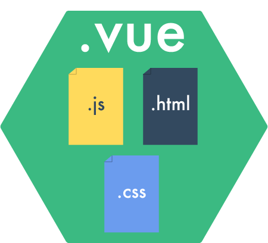

# VueJS - WebPack
<br>
<small>by Peter Cosemans</small>

<br>
<small>
Copyright (c) 2017 Euricom nv.
</small>

<hr>

Note: TOC

<!-- TOC -->

- [VueJS - WebPack](#vuejs---webpack)
- [Vue Component Spec](#vue-component-spec)
    - [.vue file](#vue-file)
- [Setup](#setup)
    - [Index.html](#indexhtml)
    - [Vue App and component](#vue-app-and-component)
    - [WebPack & Npm Modules](#webpack--npm-modules)
    - [Optional](#optional)
- [Components](#components)
    - [Register components](#register-components)
    - [.vue Component](#vue-component)
    - [Template Based Component (ES6)](#template-based-component-es6)
- [Styling](#styling)
    - [Styling in .vue file](#styling-in-vue-file)
    - [Scoped styling](#scoped-styling)
    - [Less](#less)
    - [Webpack Extract CSS](#webpack-extract-css)
- [Exercise](#exercise)
    - [Application structure](#application-structure)
- [ESLint your vue files](#eslint-your-vue-files)
    - [Setup](#setup-1)
    - [Setup - VSCode](#setup---vscode)
- [Exercise (large)](#exercise-large)
- [Resources](#resources)

<!-- /TOC -->

---

# Vue Component Spec

> The *.vue files syntax

----

## .vue file

```html
<template lang="html">
  <div class="example">
    <h1>{{ title }}</h1>
    <other-component/>
</template>
```
```html
<script>
import otherComponent from 'component/otherComponent'
export default {
    data () {
        return {
            title: 'Hello world!'
        }
    }
}
</script>
```
```html
<style lang="sass" scoped>
$font-stack: Helvetica;
$primary-color: #333;
.example {
    font: 100% $font-stack;
    color: $primary-color;
</style>
```

---

# Setup

> Lets build with WebPack, ES6+ and .vue files

https://vue-loader.vuejs.org/en/

----

## Index.html

```html
<!-- index.html -->
<!DOCTYPE html>
<html lang="en">
    <head>
        <meta charset="utf-8">
        <title>Vue with WebPack</title>
    </head>
    <body>
        <div id="app"></div>
        <script src="/bundle/bundle.js"></script>
    </body>
</html>
```

----

## Vue App and component

Create our vue app (notice the render function)

```js
// main.js
import Vue from 'vue'
import App from './app.vue'
new Vue({
    el: '#app',
    render: h => h(App),
})
```

The app (root) component

```html
<template>
  <div id="app">
    <h1>{{title}}</h1>
  </div>
</template>

<script>
export default {
  name: 'app',
  data () {
    return {
        title: 'Vue with WebPack'
    }
  }
}
</script>
```

----

## WebPack & Npm Modules

Now we take VueJS via npm

```bash
$ npm install vue --save
```

To process .vue files we need the vue-loader

```bash
$ npm install vue-loader vue-template-compiler --save-dev
```

And configure it

```js
// webpack.config.js
module: {
    rules: [
        ...
        { test: /\.vue$/, loader: 'vue-loader' },
    ],
},
plugins: [
    new webpack.DefinePlugin({
        'process.env': {
            // this is required for vue.common.js (default)
            NODE_ENV: JSON.stringify(process.env.NODE_ENV || 'development'),
        },
    }),
],
```

----

## Optional

Optional you can configure the vue build and aliases for easy access

```js
// webpack.config.js
resolve: {
    alias: {
        // easy access to components
        'components': path.resolve(__dirname, '../app/components'),
        // specifies the full commonJS build: default
        // https://github.com/vuejs/vue/blob/dev/dist/README.md
        'vue': 'vue/dist/vue.common.js',
    },
},
```

> More info about vue-loader: https://vue-loader.vuejs.org/en/

---

# Components

> Just a collection of .vue files

----

## Register components

Javascript style

```js
var MyComponent = Vue.extend({
...
})
Vue.component('my-component', MyComponent)
```

app.vue (local registration)

```js
import MyComponent from './components/myComponent.vue'
export default {
  components: {
    // list the components used in this component
    MyComponent,
  },
  data () {
    ...
  }
}
```

----

## .vue Component

./components/message.vue

```html
<template>
    <div>
        <h1>{{message}}</h1>
    </div>
</template>

<script>
export default {
    name: 'message',
    data() {
        return {
            message: 'Hello from messsage'
        }
    },
}
</script>
```

> The name property over-rules

----

## Template Based Component (ES6)

```js
import Vue from 'vue'

export default Vue.extend({
    template: `
        <div>
            <span>{{title}}</span>
        </div>
    `,
    name: 'sample',
    data () {
        return {
            title: 'My awesome component',
        }
    },
})
```

Or you can import template & style (need html & less loader)

```js
import Vue from 'vue'
import template from './sample.html'
import './sample.less'

export default Vue.extend({
    template,
    name: 'sample',
    data () {
        ...
    },
})
```

---

# Styling

> Power to your styles

----

## Styling in .vue file

```html
<!-- message.vue -->
<template>
</template>

<script>
</script>

<style>
h1 {
    color: red
}
</style>
```

Notice that the style is applied to the full application

----

## Scoped styling

```html
<!-- message.vue -->
<style scoped>
h1 {
    color: red
}
</style>
```

Notice that not the styling is now only applied to the `Message` component

> CSS Modules are also supported
> https://vue-loader.vuejs.org/en/features/css-modules.html

----

## Less

Less loader and dependencies

```bash
npm install less-loader less --save-dev
```

Specify less as language

```less
<!-- message.vue -->
<style lang="less">
@import "~bootstrap/dist/css/bootstrap.css";
@import (reference) "../variable.less"
@alert-color: red
h1 {
    color: @alert-color
}
</style>
```

Now you can use:

- Variables
- Import other files
- And all other nifty less features

<small>
[Learn LESS in 10 Minutes](http://tutorialzine.com/2015/07/learn-less-in-10-minutes-or-less/)
</small>

----

## Webpack Extract CSS

```bash
npm install extract-text-webpack-plugin@2.x --save-dev
```

```js
// webpack.config.js
var ExtractTextPlugin = require("extract-text-webpack-plugin")

module.exports = {
  // other options...
```
```js
  module: {
    rules: [
        {
            test: /\.vue$/,
            loader: 'vue-loader',
            options: {
                loaders: {
                    less: ExtractTextPlugin.extract({
                        loader: 'css-loader!less-loader',
                        fallbackLoader: 'vue-style-loader',
                    }),
                },
            },
        },
    ]
  },
```
```js
  plugins: [
    new ExtractTextPlugin("style.css")
  ]
}
```

---

# Production

> Optimize your build

----

## Optimize

Use Webpack’s DefinePlugin to indicate a production environment, so that warning blocks can be automatically dropped by UglifyJS during minification.

```js
var webpack = require('webpack')
module.exports = {
  // ...
  plugins: [
    // ...
    new webpack.DefinePlugin({
      'process.env': {
        NODE_ENV: '"production"'
      }
    }),
    new webpack.optimize.UglifyJsPlugin({
      compress: {
        warnings: false
      }
    })
  ]
}
```

---

# Exercise

> Refactor the bootstrap Alert component (from previous exercise) to a .vue component.

- You need to import bootstrap as npm module
- Make bootstrap globally available

---

## Application structure

```
├─ index.thml
├─ main.js
├─ routing.js
├─ core
│   ├── util.js                 # re-usable utilities
│   ├── util.spec.js
│   └── ...
```
```
├─ services                     # app services
│   ├── customerApi
│   ├── customerApi.spec.js
│   ├── authService
│   └── ...
```
```
├─ components
│   └── app.vue
│   ├── app.spec.js
│   ├── orders
│   │     ├── orderList.vue
│   │     ├── orderDetail.vue
│   │     └── ...
│   └── customer                # alternative component per folder
│        ├── customer.js
│        ├── customer.html
│        ├── customer.scss
│        ├── customer.spec.js
│        ├── helper.js
│        ├── helper.spec.js
│        └── ...
```

---

# Loading data
> Get the data from the backend

----

## Using fetch

```js
fetch('api/users')
    .then(checkStatus)
    .then(res => res.json())
    .then(users => {
        console.log(users)
    })
    .catch(err => {
        console.log(err)
    })

function checkStatus(res) {
    if (!res.ok) {
        throw Error(res.statusText);
    }
    return res;
}
```

> [Can I Use - Fetch](http://caniuse.com/#search=fetch)

----

## Using Axios

```bash
$ npm install axios
```

```js
import axios from 'axios'

axios.get('/user?ID=12345')
    .then(res => {
        console.log(res.data);
    })
    .catch(res => {
        console.log(res.status, res.statusText);
    });
```

---

# ESLint your vue files

> Don't forget your linting

----

## Setup

Install

```bash
npm install --save-dev eslint-plugin-vue eslint-config-vue
```

Config .eslintrc

```json
{
    extends: ["vue", /* your usual extends */ ],
    plugins: ["vue"],
}
```

Setup script: package.json

```json
"scripts": {
    "lint": "eslint 'app/**/*.{js,vue}'"
},
```

> VSCode need an additional setup!

----

## Setup - VSCode

settings.json

```json
// linting vue files
"files.associations": {
    "*.vue": "vue"
},
"eslint.options": {
    "extensions": [".js", ".vue"]
},
"eslint.validate": [
    "javascript",
    "javascriptreact",
    "html",
    "vue"
],

```

---

# Exercise (large)

> Build an app to show a list of users

- Use the /api/user API from (vuejs-webpack-api)
- To make a http call you can use `fetch` api or `axios` library
- Use bootstrap for styling
- Show image, fullname, email and age in table format.
- Optional
    - Make an alternative view to show users in panels (and switch between the views)
    - Make the headers clickable to sort rows

---

# Resources

- [vue-loader](https://vue-loader.vuejs.org/en/)

- [Vue tooling for VSCode](https://marketplace.visualstudio.com/items?itemName=octref.vetur)

- [ES / TypeScript decorator for class-style Vue](https://github.com/vuejs/vue-class-component)
