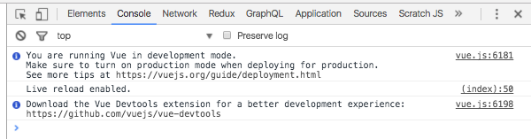

# VueJS - Intro
<br>
<small>by Peter Cosemans</small>

<!-- Align our list to the left -->
<style type="text/css">
/*  .reveal p {
    text-align: left;
  }
*/
  .reveal ul {
    display: block;
  }
  .reveal ol {
    display: block;
  }
</style>

---

# Quick Start

> Easy does it.

----

## Plain old javascript

```html
<!DOCTYPE html>
<html lang="en">
  <head>
    <meta charset="UTF-8">
    <title>My First Vue</title>
  </head>
  <body>
    <input type="text" id="input">
    <script>
      let data = {
        message: 'Hello World'
      }
      document.querySelector('#input').value = data.message
    </script>
  </body>
</html>
```

Launch your webpage by using ```serve``` or ```live-server```

```bash
$ live-server
Serving "/Users/me/git/vue" at http://127.0.0.1:8080
GET /favicon.ico 404 2.100 ms - 24
```

----

## VueJS

Add VueJS

```html
<script src="https://unpkg.com/vue@2.1.10/dist/vue.js"></script>
```

Replace the script

```html
<script>
    new Vue({
        el: '#root',
        data() {
            return {
                message: 'Hello World'
            }
        }
    })
</script>
```

Add a template binding

```html
<div id="root">
    <input type="text" id="input" v-model="message">
    <p>The Value of the input is: {{message}}</p>
</div>
```

This gives us 2-way binding with the ```v-model``` directive and output binding with ```{{...}}```.

----

## Devtools

Open devtools and notice the following message:



[Get it on the Chrome Web Store](https://chrome.google.com/webstore/detail/vuejs-devtools/nhdogjmejiglipccpnnnanhbledajbpd)

You can inspect the Vue components and interact with them. See also the $vm0 (and others)
variabled to inpect or change via the console.

> Single root of truth: the view, the data, the console, the devtools.

----

## Refactor with JS file

Let move the javascript to separate file: main.js

```js
// eslint-disable-next-line
new Vue({
    el: '#root',
    data: {
        message: 'Hello World',
    },
})
```

And reference the main.js

```html
<body>
    <div id="root">
        <input type="text" id="input" v-model="message">
        <p>The Value of the input is: {{message}}</p>
    </div>

    <script src="https://unpkg.com/vue@2.1.10/dist/vue.js"></script>
    <script src="./main.js"></script>
</body>
```

---

# Binding

> Connect your model to the view

----

## Value Binding

Simple binding (mustaches)

```html
<p>The Value of the input is:
    <span>{{message}}</span>
</p>
```

`v-text` directive

```html
<p>The Value of the input is:
    <span v-text="name"></span>
</p>
```

`v-html` directive

```html
<div v-html="rawHtml"></div>
```

Using javascript expressions

```html
{{ number + 1 }}
{{ ok ? 'YES' : 'NO' }}
{{ message.split('').reverse().join('') }}
```

----

## Computed properties

```html
<span>new Date()</span>
<ul>
    <li v-for="item in tasks" v-if="item.completed">
        {{item.description}}
    </li>
</ul>
```

vs

```html
<span>{{now}}</span>
<ul>
    <li v-for="item in incompleteTasks">
        {{item.description}}
    </li>
</ul>
```

```js
data() {
    ...
},
computed: {
    now() {
        return new Date()
    }
    incompleteTasks() {
        return this.tasks.filter(task => !task.completed)
    }
}
```

----

## Filters

Simple text formatting

```html
{{ message | toUpperCase }}

<div v-text="date | formatDate"></div>
```

```js
new Vue({
    // ...
    filters: {
        toUpperCase: function (value) {
            if (!value) return ''
            return value.toString().toUpperCase();
        }
    }
})
```

Can take arguments

```html
    {{ message | filterA('arg1', arg2) }}
```

Can be chained

```html
    {{ message | filter1 | filter2 }}
```

VueJS 2.0 doesn't has standard filters: [3th party package](
https://github.com/freearhey/vue2-filters)

----

## List Binding

Create a list

```js
data() {
    return {
        message: 'Hello World',
        names: ['Joe', 'Mary', 'Jane', 'Jack'],
    }
},
```

Use the ```v-for``` directive

```html
<div id="root">
    ...
    <ul>
        <li v-for="name in names">{{name}}</li>
    </ul>
</div>
```

> You can inpect the array in the devTools

----

## Conditional Rendering

`v-if` and `v-else` directive

```html
<div v-if="Math.random() > 0.5">
  Now you see me
</div>
<div v-else>
  Now you don't
</div>
```

`v-show`  directive

```html
<h1 v-show="ok">Hello!</h1>
```

> `v-show` is using CSS to show/hide content, `v-if` removes the content from the dom.

----

## Attributes Binding

Set button title

```html
    <button title="hit me">Add</button>
```

Set button title at runtime: `v-bind` directive

```js
data() {
    return {
        names: ['Joe', 'Mary', 'Jane', 'Jack'],
        buttonTitle: 'Click me to add a name',
    }
}
```

```html
<button v-bind:title="title">Add</button>
```

Or shorthand syntax (mostly used)

```html
<button :title="title">Add</button>
```

----

## Attributes Binding

Use it for classes

```html
<button :class="buttonClass">Add</button>
```

```js
data() {
    return {
        buttonClass: 'active'
    }
}
```

Conditional Class binding

```html
<style>
  .is-loading { background: red; }
</style>

<button :class="{ 'is-loading': isLoading }">
```

```js
data() {
    return {
        ...
        isLoading: false,
    }
}
```

> More: https://vuejs.org/v2/guide/class-and-style.html

---

# Events

> React to user input

----

## Listening to events

```html
<!-- `greet` is the name of a method defined below -->
<button v-on:click="greet($event)">ClickMe</button>
```

Or shorthand syntax (mostly used)

```html
<button @click="greet($event)">ClickMe</button>
```

Event Handler

```js
var example2 = new Vue({
    ...
    data() {
        return {
            name: 'Vue.js'
        },
    },
    // define methods under the `methods` object
    methods: {
        greet: function (event) {
            // `this` inside methods points to the Vue instance
            alert('Hello ' + this.name + '!')
            // `event` is the native DOM event
            if (event) {
                alert(event.target.tagName)
            }
        }
    }
})
```

----

## Event modifier

It is a very common need to call `event.preventDefault()` or `event.stopPropagation()` inside event handlers.

```js
methods: {
    greet: function (event) {
        event.preventDefault();
        ...
    }
}
```

Simplified

```html
<a @click.prevent="greet($event)"></a>
```

Key modifiers:

```html
<!-- only call vm.submit() when the keyCode is 13 -->
<input v-on:keyup.13="submit">
```

More: https://vuejs.org/v2/guide/events.html#Event-Modifiers

----

# Exercise

> Use a button to toggle (hide/show) a paragraph of text

---

# Components

> The power of VueJS

----

## What are components

It's like a WebComponent without any polyfill.

```js
// Extend Vue to get a reusable constructor
var MyComponent = Vue.extend({
    template: '<div>A custom component!<div>'
})

// Register the constructor with id: my-component
Vue.component('my-component', MyComponent)

// create app
new Vue({
    el: '#root',
    ...
})
```

Simplified

```js
Vue.component('my-component', {
    template: 'A custom component!'
})
```

And use

```html
<div id="root">
    <my-component></my-component>
</div>
```

----

## Slots

Its like React Children & Angular transclude, its passes all the inner content (like inner html) to the template.

```js
var MyComponent = Vue.extend({
    template: `
        <div>
            <h1>{{title}}</h1>
            <slot></slot>
        </div>
    `,
    data() {
        return {
            title: 'My Component'
        }
    }
})
```

And use it

```html
    <div id="root">
        <my-component>
            <span> Add some text here </span>
        </my-component>
    </div>

```

----

## Custom properties: props

```js
var MyComponent = Vue.extend({
    props: [
        'title',
        'sub-message'
    ],
    template: `
        <div>
            <h1>{{title}}</h1>
            <h3>{{subTitle}}</h3>
            <slot></slot>
        </div>
    `
})
```

```html
    <div id="root">
        <my-component title="My Component Title" sub-title="bla bla bla">
            <span> Add some text here </span>
        </my-component>
    </div>

```

More https://vuejs.org/v2/guide/components.html#Prop-Validation

----

## Dynamic props

You can use `v-bind` on custom properties

```html
<my-component :title="title" :sub-title="subTitle">
    <span> Add some text here </span>
</my-component>
```

----

## Custom events

```js
var MyComponent = Vue.extend({
    template: `
        <div>
            <h1>My Super Button</h1>
            <button @click="onClick()">Finish</button>
        </div>
    `,
    methods: {
        onClick() {
            this.$emit('handled', { id: 123 })
        }
    }
})
```

```html
<div id="root">
    <my-component @handled="onHandled($event)">
    </my-component>
</div>
```

----

## Lifecycle events

```js
created() {
    // Instance is created
}
mounted() {
    // vm.$el is created (html in doc)
},
updated() {
    // Called after a data change
},
destroyed() {
    // Called after a Vue instance has been destroyed
}
```

More: https://vuejs.org/v2/guide/instance.html#Lifecycle-Diagram

---

# Exercise

> Create dismissible bootstrap alert

- Use bootstrap styling: http://getbootstrap.com/components/#alerts-dismissible
- Create VueJS component

```html
    <!-- default alert: warning -->
    <alert>
        Almost out of stock
    </alert>

    <!-- custom alert with event -->
    <alert type="alert" @closed="onClosed()">
        <strong>Alert!</strong> We have a problem.
    </alert>
```

- Don't use jqeury or the bootstrap js library

---

# Form Input Bindings

> Get your user input

----

## Basic Usage

```html
<!-- text -->
<input v-model="message" placeholder="edit me">
<p>Message is: {{ message }}</p>
```
```html
<!-- checkbox -->
<input type="checkbox" id="checkbox" v-model="checked">
<label for="checkbox">{{ checked }}</label>
```
```html
<!-- radio -->
<input type="radio" id="one" value="One" v-model="picked">
<label for="one">One</label>
<br>
<input type="radio" id="two" value="Two" v-model="picked">
<label for="two">Two</label>
<br>
<span>Picked: {{ picked }}</span>
```
```html
<!-- select -->
<select v-model="selected">
    <option v-for="option in options" :value="option.value">
        {{ option.text }}
    </option>
</select>
<span>Selected: {{ selected }}</span>
```


---

## App Events

> Communicating between components

----

Communicating between components with direct access

```js
    this.$root          // app root
    this.$parent        // parent component
    this.$children      // children components
```

> ***Warning***: Only use them when you know why you should.

----

## Event Bus

In simple scenarios, you can use an empty Vue instance as a central event bus.

```js
    var bus = new Vue();
```

In a component

```js
    bus.$emit('myEvent', 123)              // same instance
```

And listen for it

```js
    but.$on('myEvent', (value) => {
        ...
    })
```

----

## Event Aggregator

```js
class EventAggregator {
    constructor() {
        this.vue = new Vue();
    }

    fire(event, data = null) {
        this.vue.$emit(event, data);
    }

    listen(event, callback) {
        this.vue.$on(event, callback);
    }
}
export const eventAggregator = new EventAggregator();
```

Usage

```js
import { eventAggregator } from 'eventAggregator'

// component A
methods: {
    onClick() {
        eventAggregator.fire('myEvent', { ... })
    }
}

// component B
created() {
    eventAggregator.listen('myEvent', (value) => {
        console.log('handle it: ', value)
    })
}
```

---

## Directives

> Extend the behavior of existing elements

----

Like the build in directives `v-text`, `v-show` but build yourself.

```js
Vue.directive('focus', {
    // When the bound element is inserted into the DOM...
    inserted: function (el) {
        // Focus the element
        el.focus()
    }
})
```

And use it

```html
<input v-focus>
```

More: https://vuejs.org/v2/guide/custom-directive.html#Hook-Functions

---

# Exercise

- We have the following translation service

```js
    class TranlationService {
        constructor() {
            this.translations = {
                'Welcome to Vue': {
                    nl: 'Welkom in Vue',
                },
                ...
            }
        }
```
```js
        getTranslation(message) {
            const trans = this.translations[message][this.language];
            return trans || message;
        }
        setLanguage(language) {
            this.language = language
        }
    }
```

- Create a translate ***directive*** based on a selected language

```html
    <button @click="setLang('nl)">NL</button>
    <button @click="setLang('en)">EN</button>
    <h1 translate>Welcome to Vue</h1>

    output:
    <h1>Welkom in Vue</h1>
```

---

# Vue Component Spec

> The *.vue files syntax

----

## .vue file

```html
<template>
  <div class="example">{{ msg }}</div>
</template>
```
```html
<script>
export default {
  data () {
    return {
      msg: 'Hello world!'
    }
  }
}
</script>
```
```html
<style lang="sass" scoped>
.example {
  color: @alertColor;
}
</style>
```

> To use this file we need webpack (or browserify) with a custom loader.

---

# VueJS vs Angular2

> They are more common then you think

----

## Templates

    Angular2                  VueJS
    ---------------           ----------------
    [attr]="value"            :attr="value" or v-bind:attr="value"
    (click)="onClick()"       @click="onClick" or v-on:click="onClick"
    @Input() name             props: ['name']
    {{name}}                  {{name}}
    [innerHtml]="rawHtml"     v-html="rawHtml"
    *ngFor="item of items"    v-for="item in items"
    *ngIf="condition"         v-if="condition"
    [hidden]="condition"      v-show="condition"
    {{ message | uppercase }} {{ message | uppercase}}
    {{ msg | upper:5 }}       {{ msg | upper 5}}
    ngModel="name"            v-model="name"

----

## Components

```js
// Angular2
@Component({
    selector: 'counter',
    template: `<div>{{sample}}</div>`,
})
export class CounterComponent {
    constructor() {
        this.name = 'sample'
    }
    ngOnInit() {
    }
    onCustomHandle() {
    }
}
```

```js
// VueJS
Vue.component('counter', {
    template: `<div>{{sample}}</div>`,
    methods: {
        onCustomHandle() {
        }
    },
    data: {
        return {
        name: 'sample',
        }
    }
    created() {
    },
});
```

----

## Events

Angular2

```html
    <myComponent (myEvent)="onEvent($event)">
```

```js
    @Ouput() myEvent = new EventEmitter()
    myEvent.emit(value)
```

VueJS

```js
    <myComponent @myEvent="onEvent($event)">
```

```js
    this.$emit('myEvent', value)
```

---

# Resources

Learn

- [Learn Vue 2: Step By Step](https://laracasts.com/series/learn-vue-2-step-by-step)
- [Vue.js, Vuex, and Testing; an Introduction](http://tyronetudehope.com/2016/11/24/vue-js-vuex-testing-an-introduction)
- [VueJs: Filters](https://coligo.io/vuejs-filters/)

General

- [How popular is VueJS in the industry?](https://www.quora.com/How-popular-is-VueJS-in-the-industry)

Advanced

- [Vue.js JSDOM](https://forum.vuejs.org/t/vue-js-jsdom-doesnt-render-properly/1283/4)


