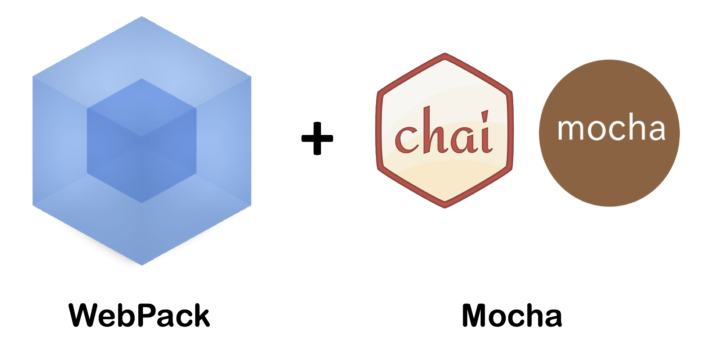

# Unit Test with WebPack & Mocha
<br>
<small>by Peter Cosemans</small>

<br>
<small>
Copyright (c) 2017 Euricom nv.
</small>

---

# Testing Web App's

> What setup do I need?

----

## Karma (Browser testing)

Typically used in Angular environments. And its the first choice for many developers. All tests are run in the browser (Chrome, Edge or PhantomJS).

Frameworks:

- Karma
- Mocha / Chai / Sinon
- WebPack (optional)

See: https://github.com/webpack/karma-webpack

----

### Mocha-WebPack

A setup where all tests are running in nodeJS and targeting jsdom (a mocked version of the DOM), which makes this setup flexible and super fast.

Frameworks:

- Mocha / Chai / Sinon
- WebPack
- mocha-webpack
- jsdom

---

# Mocha & Webpack

> Makes a powerfull combination

----

## mocha-webpack

mocha-webpack is basically a wrapper around the following command...

    $ webpack test.js output.js && mocha output.js

... but in a much more powerful & optimized way.


----

## mocha-webpack

- Precompiles your test files automatically with webpack before executing tests
- Handles source-maps automatically for you
- Does not write any files to disk (faster)
- Understands globs & all other stuff as test entries like mocha
- Only re-runs tests which related code is changed

See: http://zinserjan.github.io/mocha-webpack/index.html

----

## Setup

Install

```bash
npm instal mocha chai mocha-loader mocha-webpack@^1.0.0-beta webpack-node-externals
```

Version & help

```bash
node ./node_modules/mocha-webpack/bin/mocha-webpack --version
node ./node_modules/mocha-webpack/bin/mocha-webpack --help
```

Startup

```json
// package.json
"scripts": {
    "test": "mocha-webpack --webpack-config webpack.test.config.js app/**/*.spec.js"
},
```

----

## Setup

The webpack config file: `webpack.test.config.js`

```js
const nodeExternals = require('webpack-node-externals')

module.exports = {
```
```js
    // in order to ignore built-in modules like path, fs, etc.
    target: 'node',

    // in order to ignore all modules in node_modules folder (faster)
    externals: [nodeExternals()],
```
```js
    // define your rules here
    module: {
        rules: [
            // basic babel loader (if using ES.Next)
            { test: /\.js$/, loader: 'babel-loader' },

            // don't process css/sass files (much faster)
            { test: /\.scss$/, loader: 'null-loader' },
            { test: /\.css$/, loader: 'null-loader' },
        ],
    },
}

```

----

## Add source maps

Notice the call stack! This is not very usefull.

```
AssertionError: expected true to equal false
    ...
    at Context.it (.tmp/mocha-webpack/bundle.js:81:86)
```

We can fix this by configuring the source map support

```js
// webpack.test.config.js
module.exports = {
    target: 'node',
    externals: [nodeExternals()],
    output: {
        // use absolute paths in sourcemaps (important for debugging via IDE)
        devtoolModuleFilenameTemplate: '[absolute-resource-path]',
        devtoolFallbackModuleFilenameTemplate: '[absolute-resource-path]?[hash]',
    },
    // lets webpack add inline source maps
    devtool: 'inline-cheap-module-source-map',
}
```

You now get a better callstack

    ...
    at Context.it (app/main.spec.js:8:1)

---

# jsdom

> The browser in your console

jsdom is a JavaScript based headless browser that can be used to create a realistic testing environment.

----

## Setup

First of all you need to install jsdom

```bash
npm install jsdom --save-dev
```

Create a helper script to prepare the jsdom environment

```js
const jsdom = require('jsdom').jsdom
global.document = jsdom('')
global.window = document.defaultView
window.console = global.console

Object.keys(document.defaultView).forEach((property) => {
  if (typeof global[property] === 'undefined') {
    global[property] = document.defaultView[property]
  }
})

global.navigator = {
    userAgent: 'node.js'
}
```

----

## Setup

And finally use the `setup.js` using the --require option

```bash
    mocha-webpack --require test/setup.js --webpack-config
                        webpack.test.config.js app/**/*.spec.js
```

You can test it with following test

```bash
it('has document', function () {
    var div = document.createElement('div')
    expect(div.nodeName).to.equal('DIV')
})
```

---

# Resource

    Unit Testing Using Mocha, React, and Webpack
    https://www.youtube.com/watch?v=jhRx6r7BQNI
